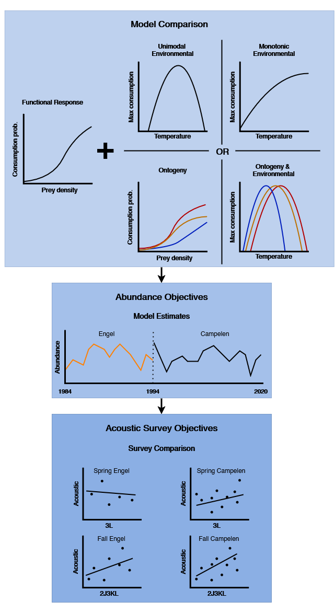

# Comparing capelin abundance estimates from predator diet data and an acoustic survey

# Citation
Lynch, K.E. 2025. Comparing capelin abundance estimates from predator diet data and an acoustic survey: Zenodo code release. DOI: .

# Contact

Author - [Kerri E. Lynch](Kerri.Lynch@mi.mun.ca), Marine Institute of Memorial University. 

# Summary

This code accompanies Lynch et al. (Submitted), where we estimated an abundance index for capelin in the Northwest Atlantic between 1984 - 2020.

# Code purpose and order

This code is intended to allow readers/reviewers the ability to repeat analyses in the paper.

1. The first script to run is `[...]-SetUp.R`. This script will load csv files containing trawl catch data and predator stomach content data, 
\n and then prepare them following methods described in detail from Lynch et al. (Submitted) to be used in the NLFPM. Due to data availability
\n limitations, example data cannot be shared.

2. The second script is `[...]_Length.R`. This script will format the data from `[...]-SetUp.R` to be used in `SclNLFPM.cpp` to estimate 
\n parameters related to the functional response, which will be used to estimate an abundance index. This script will also run the model.

# File descriptions

`Analysis/` - Folder housing Rscripts used to set up and run models for different geartypes (Campelen, Engel) and seasons (fall, spring)

* `Campelen/`
    + `Fall/`
      - `FallCamp-SetUp.R` - R script for loading fall Campelen data for modelling
      - `FallCamp-Base.R` - R script for running fall Campelen data with the Base NLFPM
      - `FallCamp-Length.R` - R script for running fall Campelen data with the Length NLFPM (ontogentic effect)
      - `FallCamp-monoTemp.R` - R script for running fall Campelen data with the monoTemp NLFPM (temperature effect)
      - `FallCamp-monoTempLength.R` - R script for running fall Campelen data with the monoTempLength NLFPM (temperature and ontogentic effect)
      - `FallCamp-Temp.R` - R script for running fall Campelen data with the Temp NLFPM (temperature effect)
      - `FallCamp-TempLength.R` - R script for running fall Campelen data with the TempLength NLFPM (temperature and ontogentic effect)
    + `Spring/`
      - `SprCamp-SetUp.R` - R script for loading spring Campelen data for modelling
      - `ACAP-SprCamp_Base.R` - R script for running Atlantic cod and American plaice spring Campelen data with the Base NLFPM
      - `GH-SprCamp_Base.R` - R script for running Greenland halibut spring Campelen data with the Base NLFPM
* `Engel/`
    + `Fall/`
      - `FallEng-SetUp.R` - R script for loading fall Engel data for modelling 
      - `ACAP-FallEng_Length.R` - R script for running fall Engel data with the Length NLFPM
      - `GH-FallEng_Length.R` - R script for running fall Engel data with the Length NLFPM
    + `Spring`
      - `SprEng-SetUp.R` - R script for loading spring Engel data for modelling
      - `SprEng_Length.R` - R script for running spring Engel data with the Length NLFPM

`TMBcode/` - Folder containing C++ code for running models 

* `SclNLFPM.cpp` - C++ file containing the Base, Length, and Temp models and likelihood functions implemented by the TMB package
* `SclNLFPM.dll` - Dynamic link library for the compiled `SclNLFPM.cpp` file
* `SclNLFPM.o` - Object file for the compiled `SclNLFPM.cpp` file

* `SppmonoTempNLFPM.cpp` - C++ file containing the monoTemp and monoTempLength models and likelihood functions implemented by the TMB package
* `SppmonoTempNLFPM.dll` - Dynamic link library for the compiled `SppmonoTempNLFPM.cpp` file
* `SppmonoTempNLFPM.o` - Object file for the compiled `SppmonoTempNLFPM.cpp` file

`Chap1.Rproj` - R project file housing the code and data within this repository

`PaperSections.Rmd` - R markdown aggregating code used for analysis in publication

`README.md` - README file formatted for Github

`SuppSections.Rmd` - R markdown aggregating code used for supplemental material accompanying the publication

